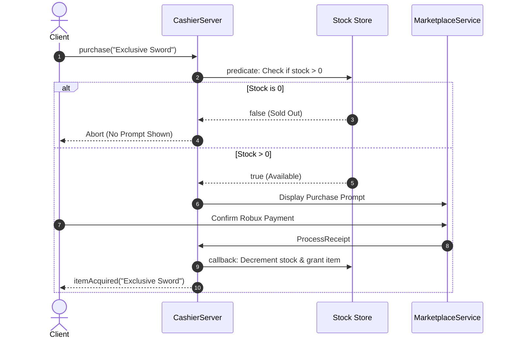

# Limited Stock Items

While Roblox Developer Products are inherently unlimited, you can easily turn any item into a **Stock-Limited Item** (or limited-time event drop) using Cashier's server-side `predicate` and `callback` lifecycle.

---

## How It Works

Creating a limited stock item requires two key steps:

1. **Gating before the prompt (`predicate`)**: Check if there is still stock available on the server before displaying the purchase prompt.
2. **Claiming stock on receipt (`callback`)**: Decrement the stock count and grant the item reward once the receipt processes successfully.



---

## Complete Example

Here is a complete, production-ready example of a stock-limited item:

### Server Setup

```lua
local ReplicatedStorage = game:GetService("ReplicatedStorage")
local Cashier = require(ReplicatedStorage.Packages.Cashier).server

-- Global stock count for the limited item
local maxStock = 100
local remainingStock = 100

Cashier:init({
    itemsData = {
        {
            name = "Dragon Slayer Sword",
            type = "DevProduct",
            id = 99887766,
            giftId = 66778899,
            
            -- 1. Predicate: Prevents prompt if sold out
            predicate = function(player: Player)
                if remainingStock <= 0 then
                    warn(`{player.Name} tried to buy Dragon Slayer Sword, but it is sold out!`)
                    return false
                end
                return true
            end,

            -- 2. Callback: Decrements remaining stock and grants the weapon
            callback = function(player: Player)
                if remainingStock <= 0 then
                    -- Stock ran out while the prompt was open
                    return false
                end

                remainingStock -= 1
                print(`{player.Name} claimed a Dragon Slayer Sword! Remaining stock: {remainingStock}/{maxStock}`)

                -- Grant the weapon to player's inventory
                InventoryService:giveWeapon(player, "Dragon Slayer Sword")

                return true
            end,
        },
    },
})
```

---

## Client Usage

On the client, purchasing a limited item uses the exact same `Cashier:purchase()` API:

```lua
local ReplicatedStorage = game:GetService("ReplicatedStorage")
local Cashier = require(ReplicatedStorage.Packages.Cashier).client

local buyLimitedButton = script.Parent

buyLimitedButton.Activated:Connect(function()
    Cashier:purchase("Dragon Slayer Sword")
end)

Cashier.itemAcquired:Connect(function(itemName)
    if itemName == "Dragon Slayer Sword" then
        print("Congratulations! You secured a limited Dragon Slayer Sword!")
    end
end)
```

---

## Handling Race Conditions

If only 1 item remains in stock, and two players open the purchase prompt at the exact same moment:

1. Both players pass the initial `predicate` check because stock is `1`.
2. The first player to confirm payment has their receipt processed: their `callback` runs, stock decrements to `0`, and the weapon is granted.
3. When the second player confirms payment: their `callback` runs and detects `remainingStock <= 0`.
4. The callback returns `false`. Cashier marks the receipt as `NotProcessedYet`, and you can either:
   - Deliver an in-game fallback reward (such as equivalent coins or gems).
   - Or allow the player to choose another item.
